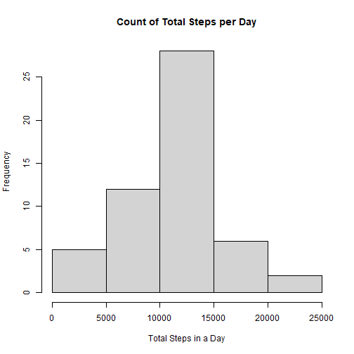
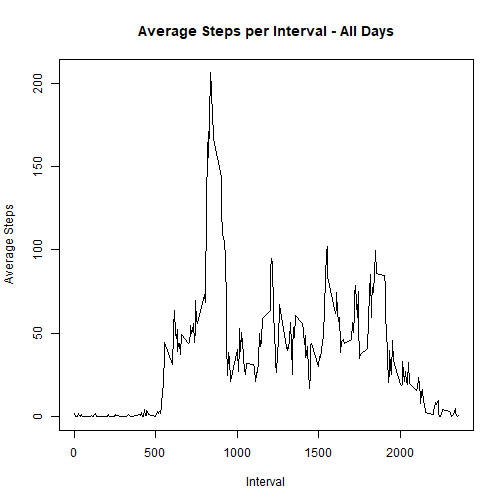
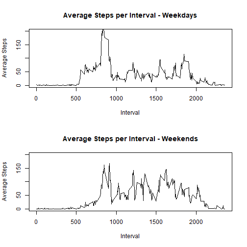

## Loading and preprocessing the data
Click below to download the dataset and save in your working directory.

Dataset: [Activity monitoring data](https://d396qusza40orc.cloudfront.net/repdata%2Fdata%2Factivity.zip) [52K]

Load appropriate packages

```r
library(tidyr)
library(dplyr)
```

Read the dataset into R and split it into: 1) individual dates, 2) total per date, 3) individual intervals, 4) mean per interval.

```r
data <- read.csv("activity.csv")
#1
data_split_date <- spread(data, 
    key = interval, 
    value = steps)
#2
data_split_date_total <- data.frame(
    Date = data_split_date$date, 
    Total = rowSums(data_split_date[,2:ncol(data_split_date)]))
#3
data_split_interval <- spread(
    data, 
    key = date, 
    value = steps)
#4
data_split_interval_mean <- data.frame(
    Interval = data_split_interval$interval, 
    Mean = rowMeans(data_split_interval[,2:ncol(data_split_interval)], 
                    na.rm =TRUE))
```

## What is the mean total number of steps taken per day?
Make a histogram of the total number of steps taken each day

```r
hist(data_split_date_total$Total, 
     main = "Count of Total Steps per Day", 
     xlab = "Total Steps in a Day")
```



Calculate and report the mean and median total number of steps taken per day

```r
Mean <- mean(
    x = data_split_date_total$Total, 
    na.rm = TRUE)
Median <- median(
    x = data_split_date_total$Total, 
    na.rm = TRUE)
data.frame(
    Mean, 
    Median, 
    row.names = "Steps")
```

```
##           Mean Median
## Steps 10766.19  10765
```

## What is the average daily activity pattern?
Make a time series plot (i.e. type = "l") of the 5-minute interval (x-axis) and the average number of steps taken, averaged across all days (y-axis)

```r
plot(
    x = data_split_interval_mean$Interval, 
    y = data_split_interval_mean$Mean, 
    type = "l", 
    main = "Average Steps per Interval - All Days", 
    xlab = "Interval", 
    ylab = "Average Steps")
```



Which 5-minute interval, on average across all the days in the dataset, contains the maximum number of steps?

```r
Maximum_Daily <- which.max(data_split_interval_mean$Mean)
Corresponding_Interval <- data_split_interval_mean$Interval[Maximum_Daily]
paste0("Maximum steps interval = ", Corresponding_Interval)
```

```
## [1] "Maximum steps interval = 835"
```

## Imputting missing values
Calculate and report the total number of missing values in the dataset (i.e. the total number of rows with NAs)

```r
data_na = sum(is.na(data))
paste0("Number of missing values = ", data_na)
```

```
## [1] "Number of missing values = 2304"
```

Devise a strategy for filling in all of the missing values in the dataset. The strategy does not need to be sophisticated. For example, you could use the mean/median for that day, or the mean for that 5-minute interval, etc.

```r
# Merge original and interval mean datasets based on the "interval" column
merged_data <- merge(
    data, 
    data_split_interval_mean, 
    by.x = "interval", 
    by.y = "Interval", 
    all.x = TRUE)
# Replace NA values in "steps" column with the corresponding values from "Mean" column
merged_data$steps[is.na(merged_data$steps)] <- merged_data$Mean[is.na(merged_data$steps)]
```

Create a new dataset that is equal to the original dataset but with the missing data filled in.

```r
new_data <- merged_data[, c("interval", "steps", "date")]
```

Make a histogram of the total number of steps taken each day and Calculate and report the mean and median total number of steps taken per day. Do these values differ from the estimates from the first part of the assignment? What is the impact of imputing missing data on the estimates of the total daily number of steps?

```r
# Split new data by date
new_data_split_date <- spread(
    new_data, 
    key = interval, 
    value = steps)

# Calculate totals per day
new_data_split_date_total <- data.frame(
    Date = new_data_split_date$date, 
    Total = rowSums(data_split_date[,2:ncol(new_data_split_date)]))

# Generate histogram
hist(new_data_split_date_total$Total, 
     main = "Count of Total Steps per Day", 
     xlab = "Total Steps in a Day")
```


```r
#Calculate new mean and median totals per day
new_Mean <- mean(
    x = new_data_split_date_total$Total, 
    na.rm = TRUE)
new_Median <- median(
    x = new_data_split_date_total$Total, 
    na.rm = TRUE)

# Display differences as data frame
result_df <- data.frame(
    Mean = c(new_Mean, Mean, new_Mean - Mean),
    Median = c(new_Median, Median, new_Median - Median)
)
rownames(result_df) <- c("New", "Old", "Difference")
colnames(result_df) <- c("Mean Steps", "Median Steps")
print(result_df)
```

```
##            Mean Steps Median Steps
## New          10766.19        10765
## Old          10766.19        10765
## Difference       0.00            0
```

## Are there differences in activity patterns between weekdays and weekends?
Create a new factor variable in the dataset with two levels -- "weekday" and "weekend" indicating whether a given date is a weekday or weekend day.

```r
new_data$date <- as.Date(new_data$date)
new_data$day_type <- ifelse(
    weekdays(new_data$date) 
    %in% c("Saturday", "Sunday"), "weekend", "weekday")
```

Make a panel plot containing a time series plot (i.e. type = "l") of the 5-minute interval (x-axis) and the average number of steps taken, averaged across all weekday days or weekend days (y-axis).

```r
# Create subsets for Weekday and Weekend
new_data_weekday <- new_data[new_data$day_type == "weekday",]
new_data_weekend <- new_data[new_data$day_type == "weekend",]

# Restructure data
new_data_weekday_split <- spread(
    new_data_weekday, 
    key = date, 
    value = steps)
new_data_weekend_split <- spread(
    new_data_weekend, 
    key = date, 
    value = steps)

# Calculate means
new_data_weekend_split_mean <- data.frame(
    Interval = new_data_weekend_split$interval, 
    Mean = rowMeans(
        new_data_weekend_split[,3:ncol(new_data_weekend_split)], 
        na.rm =TRUE))
new_data_weekday_split_mean <- data.frame(
    Interval = new_data_weekday_split$interval, 
    Mean = rowMeans(
        new_data_weekday_split[,3:ncol(new_data_weekday_split)], 
        na.rm =TRUE))

# Create plots
par(mfrow = c(2, 1))
plot(
    x = new_data_weekday_split_mean$Interval, 
    y = new_data_weekday_split_mean$Mean, 
    type = "l", main = "Average Steps per Interval - Weekdays", 
    xlab = "Interval", 
    ylab = "Average Steps",
    ylim = c(0,200)
    )
plot(
    x = new_data_weekend_split_mean$Interval, 
    y = new_data_weekend_split_mean$Mean, 
    type = "l", main = "Average Steps per Interval - Weekends", 
    xlab = "Interval", 
    ylab = "Average Steps",
    ylim = c(0,200)
    )
```


